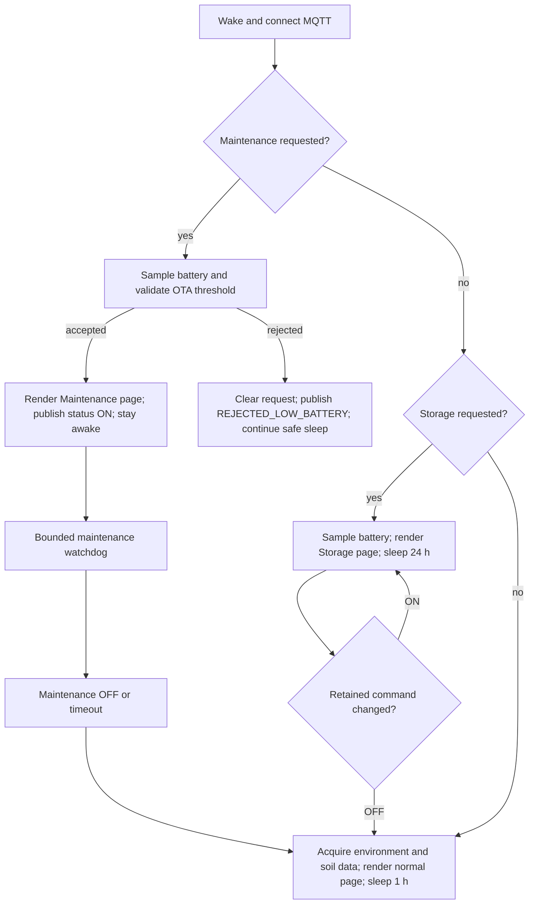

# Smart Plant operational modes — technical foundation

This document is a technical foundation for the upstream discussion proposed in
issue 24. It describes the behaviour validated in the Smart Plant V2R1 fork;
it is not an upstream PR and does not prescribe a particular Home Assistant
implementation.

## Motivation

Smart Plant devices spend most of their lifetime in deep sleep. A remote
operator therefore needs a retained command contract that survives sleep and a
separate reported state that describes what the device actually accepted.
Two operational modes use that contract:

- **Maintenance** keeps one device awake for a bounded OTA/diagnostic window.
- **Storage** reduces a parked plant to a minimal daily health check without
  publishing stale environmental measurements.

The design deliberately keeps MQTT as the Home Assistant data/control path. The
native API is optional runtime observability; it is not required for entity
availability and the device must not be added twice through the ESPHome HA
integration.

## State and topic contract

The canonical MQTT prefix is derived by ESPHome from the botanical device name
and the last three MAC bytes (`name_add_mac_suffix: true`). No device-specific
command topic is hard-coded in the shared package.

| Purpose | Topic | Retained | Meaning |
| --- | --- | --- | --- |
| Maintenance request | `<prefix>/cmd/maintenance` | yes, QoS 1 | Desired `ON`/`OFF` state |
| Maintenance result | `<prefix>/status/maintenance` | yes, QoS 1 | `ON`, `OFF`, `REJECTED_LOW_BATTERY`, or a display failure |
| Storage request | `<prefix>/cmd/storage_mode` | yes, QoS 1 | Desired `ON`/`OFF` state |
| Storage result | `<prefix>/status/storage_mode` | yes, QoS 1 | Effective `ON`/`OFF` state |

The desired command and effective status are intentionally separate. A retained
`ON` command is not evidence that the device accepted the mode.

## Boot arbitration

After MQTT reconnects, retained commands are consumed before acquisition. The
priority is deterministic:

Maintenance always wins over Storage. Storage wins over the normal acquisition
path. This prevents a retained Storage request from hiding an OTA request.

## Maintenance mode

The device performs the smallest safe preparation first: battery acquisition,
then an explicit threshold decision. On acceptance it prevents deep sleep,
refreshes the Maintenance page once, publishes effective `ON`, and starts a
bounded watchdog (currently 25 minutes in the validated deployment). Home
Assistant may then run the OTA upload. On successful OTA, timeout, or retained
`OFF`, the device clears the effective state, publishes `OFF`, and resumes the
normal lifecycle.

Important safety properties:

- Low battery is rejected before the device is held awake.
- The watchdog is a hard upper bound; retained `ON` cannot keep a device awake
  indefinitely.
- Display readiness is BUSY-aware. OTA readiness is published only after a
  complete observed refresh cycle.
- Every orderly deep-sleep path marks safe mode successful immediately before
  entering sleep, preventing false OTA rollback reports.

## Storage mode

Storage is a parked-plant mode, not a second measurement cadence. On entry and
on every daily wake, the device:

1. powers the sensor rail only long enough to read MAX17043;
2. publishes a fresh battery value;
3. renders the Storage page once and waits for a safe BUSY transition;
4. publishes effective Storage `ON` and sleeps for 24 hours.

A persisted Storage wake does **not** acquire temperature, humidity, ambient
light, or soil moisture. Those retained values therefore remain visibly stale,
which is intentional: Home Assistant does not receive false fresh telemetry for
a plant that is physically in storage.

If retained Storage changes to `OFF`, the next wake performs the complete normal
acquisition/display path and returns to the one-hour schedule. A daily battery
refresh is essential: without it, the displayed charge and low-battery alerting
would remain stale forever.

## Home Assistant integration boundary

MQTT discovery attaches the switches, status sensors, and plant measurements to
one device. Home Assistant automations may implement the orchestration:

1. publish a retained request;
2. wait for the corresponding effective status;
3. perform or stop the external operation;
4. publish the retained exit request.

The firmware does not depend on Home Assistant internals. A different MQTT
consumer can use the same contract, and a device remains safe if the broker or
controller is temporarily unavailable.

## Validation matrix

The validated fork used one canary before fleet deployment:

| Scenario | Evidence required |
| --- | --- |
| Maintenance accepted | Battery threshold, page refresh, retained status `ON`, OTA reachability |
| Maintenance rejected | Low-battery status and retained request cleared |
| Storage entry | Battery publication, Storage page, no environmental acquisition |
| Daily Storage wake | New battery timestamp/value, one page refresh, no plant telemetry |
| Storage exit | Full normal acquisition and one-hour sleep restored |
| Naming migration | Runtime topics match `<device>-<mac6>`; no legacy topic consumption |
| OTA rollback safety | No rollback log; USB factory image available |

The e-paper BUSY/refresh defect is tracked separately. It must not be conflated
with the MQTT mode protocol because display-driver behaviour can change
independently of the operational state machine.

## Upstreamization proposal

The implementation should be split into independently reviewable changes:

1. a generic retained command/effective-status framework for Maintenance;
2. Storage mode and acquisition gating;
3. Home Assistant examples and documentation;
4. separate e-paper BUSY/refresh fixes, if still needed upstream.

Defaults should remain conservative for existing users. The feature should be
opt-in or preserve the current normal one-hour lifecycle unless a mode is
explicitly requested. Each change needs a compile test, one physical canary,
and a documented rollback path.
