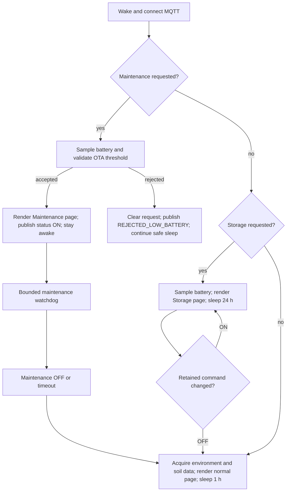

# Smart Plant operational modes — technical foundation

This document is a technical foundation for the upstream discussion proposed in
issue 24. It describes the behaviour validated in the Smart Plant V2R1 fork;
it is not an upstream PR and does not prescribe a particular Home Assistant
implementation.

## Motivation

Smart Plant devices spend most of their lifetime in deep sleep. A remote
operator therefore needs a retained command contract that survives sleep and a
separate reported state that describes what the device actually accepted.
Two operational modes use that contract:

- **Maintenance** keeps one device awake for a bounded OTA/diagnostic window.
- **Storage** reduces a parked plant to a minimal daily health check without
  publishing stale environmental measurements.

The design deliberately keeps MQTT as the Home Assistant data/control path. The
native API is optional runtime observability; it is not required for entity
availability and the device must not be added twice through the ESPHome HA
integration.

## State and topic contract

The canonical MQTT prefix is derived by ESPHome from the botanical device name
and the last three MAC bytes (`name_add_mac_suffix: true`). No device-specific
command topic is hard-coded in the shared package.

| Purpose | Topic | Retained | Meaning |
| --- | --- | --- | --- |
| Maintenance request | `<prefix>/cmd/maintenance` | yes, QoS 1 | Desired `ON`/`OFF` state |
| Maintenance result | `<prefix>/status/maintenance` | yes, QoS 1 | `ON`, `OFF`, `REJECTED_LOW_BATTERY`, or a display failure |
| Storage request | `<prefix>/cmd/storage_mode` | yes, QoS 1 | Desired `ON`/`OFF` state |
| Storage result | `<prefix>/status/storage_mode` | yes, QoS 1 | Effective `ON`/`OFF` state |

The desired command and effective status are intentionally separate. A retained
`ON` command is not evidence that the device accepted the mode.

## Boot arbitration

After MQTT reconnects, retained commands are consumed before acquisition. The
priority is deterministic:

Maintenance always wins over Storage. Storage wins over the normal acquisition
path. This prevents a retained Storage request from hiding an OTA request.

## Maintenance mode

The device performs the smallest safe preparation first: battery acquisition,
then an explicit threshold decision. On acceptance it prevents deep sleep,
refreshes the Maintenance page once, publishes effective `ON`, and starts a
bounded watchdog (currently 25 minutes in the validated deployment). Home
Assistant may then run the OTA upload. On successful OTA, timeout, or retained
`OFF`, the device clears the effective state, publishes `OFF`, and resumes the
normal lifecycle.

Important safety properties:

- Low battery is rejected before the device is held awake.
- The watchdog is a hard upper bound; retained `ON` cannot keep a device awake
  indefinitely.
- Display readiness is BUSY-aware. OTA readiness is published only after a
  complete observed refresh cycle.
- Every orderly deep-sleep path marks safe mode successful immediately before
  entering sleep, preventing false OTA rollback reports.

## Storage mode

Storage is a parked-plant mode, not a second measurement cadence. On entry and
on every daily wake, the device:

1. powers the sensor rail only long enough to read MAX17043;
2. publishes a fresh battery value;
3. renders the Storage page once and waits for a safe BUSY transition;
4. publishes effective Storage `ON` and sleeps for 24 hours.

A persisted Storage wake does **not** acquire temperature, humidity, ambient
light, or soil moisture. Those retained values therefore remain visibly stale,
which is intentional: Home Assistant does not receive false fresh telemetry for
a plant that is physically in storage.

If retained Storage changes to `OFF`, the next wake performs the complete normal
acquisition/display path and returns to the one-hour schedule. A daily battery
refresh is essential: without it, the displayed charge and low-battery alerting
would remain stale forever.

## Home Assistant integration boundary

MQTT discovery attaches the switches, status sensors, and plant measurements to
one device. Home Assistant automations may implement the orchestration:

1. publish a retained request;
2. wait for the corresponding effective status;
3. perform or stop the external operation;
4. publish the retained exit request.

The firmware does not depend on Home Assistant internals. A different MQTT
consumer can use the same contract, and a device remains safe if the broker or
controller is temporarily unavailable.

## Validation matrix

The validated fork used one canary before fleet deployment:

| Scenario | Evidence required |
| --- | --- |
| Maintenance accepted | Battery threshold, page refresh, retained status `ON`, OTA reachability |
| Maintenance rejected | Low-battery status and retained request cleared |
| Storage entry | Battery publication, Storage page, no environmental acquisition |
| Daily Storage wake | New battery timestamp/value, one page refresh, no plant telemetry |
| Storage exit | Full normal acquisition and one-hour sleep restored |
| Naming migration | Runtime topics match `<device>-<mac6>`; no legacy topic consumption |
| OTA rollback safety | No rollback log; USB factory image available |

The e-paper BUSY/refresh defect is tracked separately. It must not be conflated
with the MQTT mode protocol because display-driver behaviour can change
independently of the operational state machine.

## Upstreamization proposal

The implementation should be split into independently reviewable changes:

1. a generic retained command/effective-status framework for Maintenance;
2. Storage mode and acquisition gating;
3. Home Assistant examples and documentation;
4. separate e-paper BUSY/refresh fixes, if still needed upstream.

Defaults should remain conservative for existing users. The feature should be
opt-in or preserve the current normal one-hour lifecycle unless a mode is
explicitly requested. Each change needs a compile test, one physical canary,
and a documented rollback path.

## Issue 24 — continuation draft

The first part of this proposal comes from a practical Home Assistant use case:
I wanted a reliable way to patch a sleeping plant without repeatedly refreshing
the e-paper display, and I wanted to put plants outside or in storage without
creating false alarms in the plant-monitoring layer.

The important discovery was that this is not primarily an automation problem.
It is a small device-side state machine with an MQTT control plane. Home
Assistant can request a mode, but only the device can decide whether it has
actually accepted that request: it knows its battery level, its display BUSY
line, and whether it is safe to remain awake.

That led to two complementary modes.

### Maintenance: request, acknowledge, operate, recover

From Home Assistant, an operator publishes a retained Maintenance request. The
device receives it on its next MQTT wake and immediately performs the minimum
safe check: battery level. A device below the OTA threshold rejects the request
and reports the rejection; it does not stay awake waiting for an update.

When accepted, the device refreshes a dedicated Maintenance page, waits for a
complete e-paper BUSY cycle, publishes effective `ON`, and keeps deep sleep
prevented for a bounded watchdog window. Home Assistant can now start the OTA
operation because it has an explicit acknowledgement from the device rather
than relying on timing or an optimistic switch state.

After a successful update, an explicit `OFF`, or watchdog expiry, the device
clears the effective state and returns to its normal measurement/display/sleep
lifecycle. The retained request is therefore a durable intent, while the
reported status is the device's actual decision.

### Storage: a quiet, reversible parked-plant mode

Storage follows the same request/acknowledgement pattern, but its purpose is
energy conservation and observability. A plant can be moved outside, detached
from its probe, or left unused for a season. In that situation, continuing to
publish old-looking environmental values is misleading, while allowing the
Home Assistant plant integration to interpret silence as a fault creates false
alarms.

When Storage is accepted, the device displays its Storage page and sleeps for
24 hours. A daily wake performs only a battery read and a single display
refresh, then returns to sleep. It does not sample temperature, humidity, light,
or soil moisture. The retained values in Home Assistant are intentionally the
last known environmental values, not fabricated fresh measurements.

Storage remains reversible without physical access. Publishing retained
`OFF` causes the next wake to leave Storage, run the complete normal acquisition
path, refresh the normal page, and restore the one-hour cycle.

### What was validated in the community fork

The implementation was developed against real ESPHome devices rather than a
simulation. The following behaviours were observed on a Papyrus canary:

- canonical MAC-suffixed MQTT command and status topics were consumed by the
  firmware;
- two accelerated Storage wakes refreshed the battery and Storage page while
  leaving environmental telemetry unchanged;
- the final 24-hour firmware was compiled through ESPHome Device Builder's
  remote build pool and flashed over USB;
- the first production wake published a fresh battery value while Storage
  remained active;
- all eight device configurations compiled successfully before any fleet
  rollout.

The implementation also exposed a useful integration boundary: MQTT discovery
and retained state are enough for Home Assistant orchestration. The native API
can remain available for diagnostics and Device Builder metadata, but the
devices do not need to be added a second time through the ESPHome Home Assistant
integration.

### Suggested upstream review path

I would be happy to provide a pull request once the design direction is agreed.
To keep review and regression risk manageable, I suggest reviewing it in this
order:

1. agree on the retained command/effective-status contract;
2. review the Maintenance state machine and OTA acknowledgement path;
3. review Storage acquisition gating and the 24-hour wake policy;
4. add Home Assistant automation examples;
5. handle any remaining e-paper refresh issue independently.

The goal is not to impose one Home Assistant dashboard or one plant-monitoring
integration. The goal is to give Smart Plant a small, explicit, recoverable
device-side protocol that other MQTT consumers can use safely.
